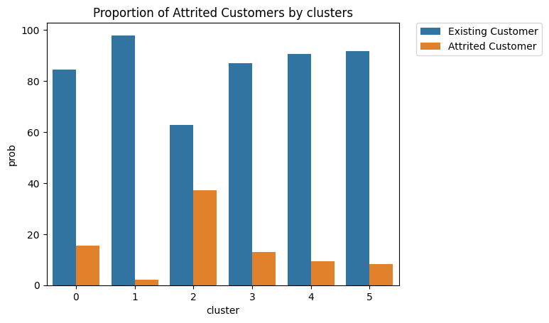

<h2 align="center"> Churn prediction project </h2>
<p align="center"><a href="https://github.com/anilembel/Churn_Prediction_Becode">
</a></p>
<h3 align="center">First project in our AI specialization at <a href="https://github.com/becodeorg"><strong>BeCode</strong></a></h3><br><br>

## Description

This repository host our first group project in our chosen specialization.

We worked on given data in order to predict whether or not a bank client is likely to churn. In order to do so, we analyzed the data to define different clusters, we then trained a model to make the prediction and finally, we deployed an easy to use app which let our users know if a specific client is at risk of churning.

The project is divided in 4 folders:

1. data_storage: upload the given .csv file to a database.
2. data_cleaning: contains graphs and cleaned data for data analyst and ML engineer.
3. modeling: use classification and clustering to make the prediction.
4. vizualisations: creation of client profile dashboard with Tableau.

## Installation

1. Clone the repo.
2. If you just wanna run the app, install the required libraries using

   ```
   pip install requirements_deployment.txt
   ```

   * numpy 1.24.2
   * pandas 1.5.3
   * pillow 9.4.0
   * scikit_learn 1.2.1
   * streamlit 1.19.0

   If you wanna run the whole code, install all the required libraries using

   ```
   pip install requirements.txt
   ```

   * imbalanced_learn 0.10.1
   * imblearn 0.0
   * ipympl 0.9.3
   * matplotlib.pyplot 3.7.0
   * numpy 1.24.2
   * pandas 1.5.3
   * pillow 9.4.0
   * pipreqs 0.4.11
   * pipreqsnb 0.2.4
   * plotly.graph_objects
   * plotly.subplots
   * scikit-learn 1.2.1
   * seaborn 0.12.2
   * skimpy
   * sqlite3 5.1.2
   * streamlit 1.19.0
3. Launch our app using

   ```
   streamlit run "app.py"
   ```

## Usage

*app.py*, which is at the root of our project contains the code of our app.
We used streamlit to better our design and docker to make it available cross OS. Using those libraries, we display a form which get specific client data, run our model using pickle and tell the user if the client is likely to churn or not.
At the bottom of the page, we included a dashboard which displays a series of graphs. (More about it in the vizualisation section.)

#### data_storage

As required, we uploaded the .csv file into a database.
We used sqlite as it was sufficient for the (non) usage we made of it afterward.

#### data_cleaning

We made an EDA (exploratory data analysis) in which we get rid of the outliers and made an analysis for each column.
We splitted data into two different parts: one categorical and one numerical.
In the end, for the ML engineer, we stored data in *Cleaned_data.csv* with the method of get dummies. For the data engineers, we stored the data in *ForDatabase_CleanedData.csv*.

#### modeling

In this folder, we worked on 2 models: one for classification and another one for clustering.
*classification.py* classifies the data between existing customer and attrited customer.
*clustering.py* defines 6 different profiles of customer and their probability to churn.



#### vizualisations

We used Tableau to create a dashboard which allows us to understand customer's profiles.
It shows the characteristics parameters of attrited customers and the KPI of the data (in numerical form).


## Results

[work in progress]

## Contact

data analyst: [Anil Furkan EMBEL
](https://github.com/anilembel)ML engineer: [Philippe Meulemans
](https://github.com/Laverdure77)data engineers: [Romain Vanden Bossche](https://github.com/vdbromain) & [Anh Sophie Noël](https://github.com/AnhSN)
