# Project Overview  

Based on customers bank profile, build a model to predict the possibility for a customer to churn or not,
using a classification model.
Run a clustering model to determine different customer profile and the propability to churn for each profile.

## 1.Classification

The classification model used for this project is KNN from SKlearn
Model is build in classification.py.  
Model is saved in a pickle file in model/classification
### Preprocessing

Starting from the raw datas, removing non relevant columns.
Selection of the features and target (Existing or Attrited Customer) for the model.
Splitting the datas to train and test samples
Data analysis reveils the dataset is imbalanced.  
Using RandomOverSampler, train set is balanced to 50%.  

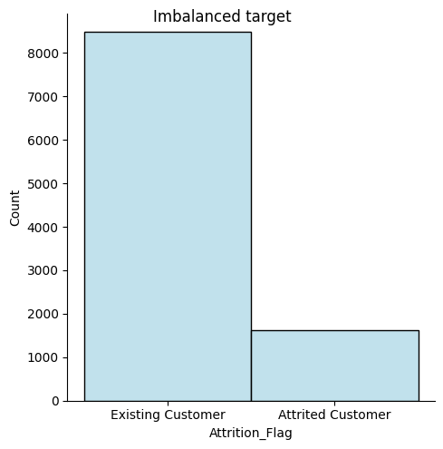  

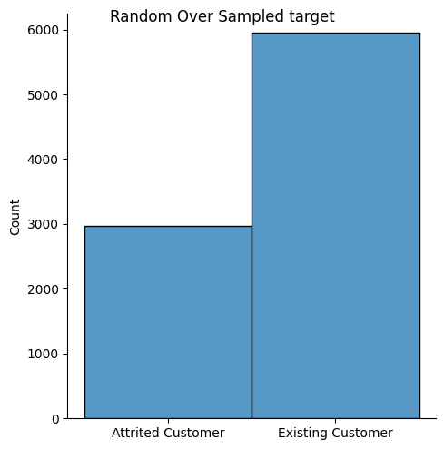

### Feature selection  

Based on PCA analysis during clustering, the most important features are selected for the two models (until gender).

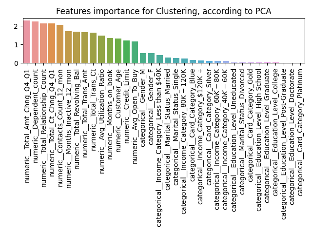

## Pipeline  

Building a model pipeline:

- SimpleImputer to fill some missing values

- For numeric datas: StandardScaler for scaling the values.
- For categorical datas: OneHotEncoder -> categorical to numerical datas

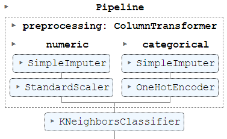

- Model :

GridSearch and cross validation on the main parameter of the model(n_neighbors)
Best result used is n_neighbors = 9 with an accuracy of 87.53 %.  

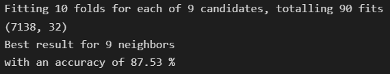

### Confusion Matrix  

The classification model is trained to detect chrurning customer profiles.
The worst case scenario would be to detect an attrited customer as an existing customer (False Negative).  
False negative are 218 or 2,15% , as shown in the confusion matrix.
The scoring metric minimizing the False Negative is recall = (TP/TP+FN).
The recall returns the proportion of positive values correctly predicted.  
Result for the classification model:  
Accuracy: 92%
Recall: 87%

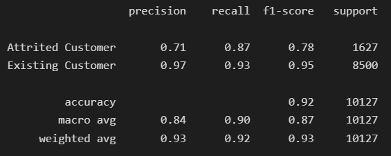

### Improvements  

- Select another model  
- test random scaler down  
- hyper parameters optimisation  

## 2.Clustering  

The classification model used for this project is KMeans.
Model is build in clustering.py.  
Model is saved in a pickle file in model/clustering

## Pipeline

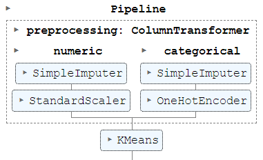

Determine the number of clusters in the customers profiles.

Based on elbow graph and silhouette score, the most relevant number of clusters is between 6 and 7.  
6 Clusters gives the best results.  
Cluster 3 has a greater probability of churning.

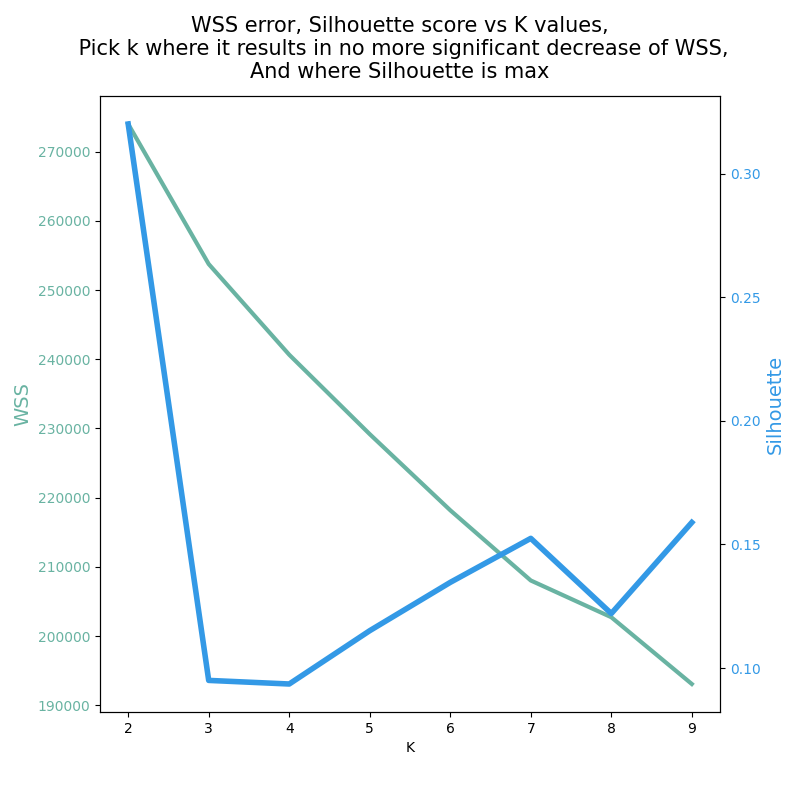  

The probability of churning is determined for each clusters.  

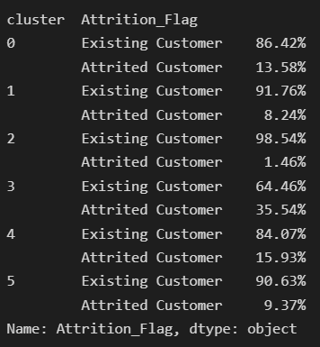  

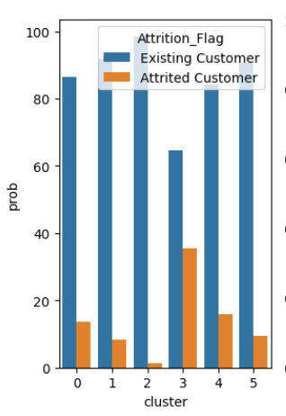  

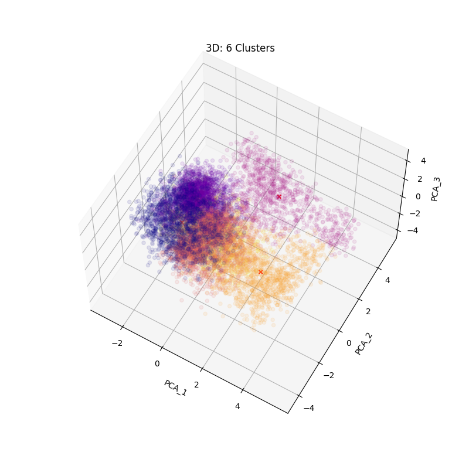  
